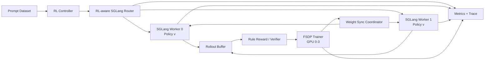
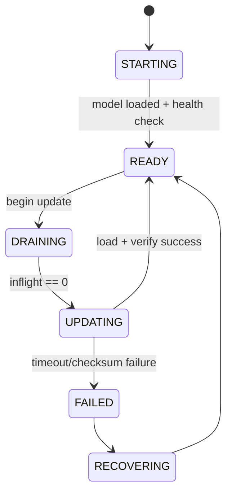

# 将现有 SGLang Router 扩展为 RL Infra：六张 RTX A6000 完整实施计划

> **项目定位**：在现有 SGLang 多 Worker 路由、Prefix/KV Cache 感知、负载均衡和长尾分析工作的基础上，构建一套面向 GRPO/RLVR 的 **Group-aware、Cache-aware、Version-aware Rollout Router**。  
> **硬件约束**：单机或同一集群内可用 **6 × NVIDIA RTX A6000 48 GB**。  
> **建议主框架**：SGLang + slime；verl 用于交叉验证和后续适配。  
> **报告版本**：v1.0  
> **日期**：2026-07-15

---

## 目录

1. [执行摘要](#1-执行摘要)
2. [项目背景与研究问题](#2-项目背景与研究问题)
3. [目标、非目标与最终交付物](#3-目标非目标与最终交付物)
4. [六张 A6000 的资源规划](#4-六张-a6000-的资源规划)
5. [总体系统架构](#5-总体系统架构)
6. [框架与技术栈选择](#6-框架与技术栈选择)
7. [核心数据模型与接口](#7-核心数据模型与接口)
8. [核心调度算法设计](#8-核心调度算法设计)
9. [Policy Version 与权重同步](#9-policy-version-与权重同步)
10. [同步到有界异步 RL 的演进](#10-同步到有界异步-rl-的演进)
11. [分阶段实施路线](#11-分阶段实施路线)
12. [代码仓库与模块划分](#12-代码仓库与模块划分)
13. [正确性验证体系](#13-正确性验证体系)
14. [实验设计与指标体系](#14-实验设计与指标体系)
15. [六卡环境下的计算预算优化](#15-六卡环境下的计算预算优化)
16. [风险、故障模式与应对方案](#16-风险故障模式与应对方案)
17. [建议时间表与里程碑](#17-建议时间表与里程碑)
18. [项目验收标准](#18-项目验收标准)
19. [论文、开源与简历包装](#19-论文开源与简历包装)
20. [第一周可直接执行的任务清单](#20-第一周可直接执行的任务清单)
21. [参考资料](#21-参考资料)

---

# 1. 执行摘要

你的原项目解决的是在线 LLM Serving 中的路由问题：

- 多个 SGLang Worker 之间的请求分配；
- Prefix/KV Cache locality；
- Round Robin、Least-load、Cache-aware 等策略；
- Worker 热点、负载倾斜和长尾；
- TTFT、P95/P99、Goodput、TPS 等指标。

将其扩展到 RL Infra 后，路由器不再只面对彼此独立的在线请求，而是面对具有以下语义约束的 **Rollout Group**：

1. 一个 Prompt 会生成多个 Response；
2. 同组 Response 通常用于 GRPO 的组内相对奖励；
3. 同组样本必须明确关联到相同的 Policy Version；
4. 每次训练更新后，Rollout Engine 需要加载新权重；
5. 训练和生成可以流水重叠，但必须控制 Policy Lag；
6. 生成长度高度不均衡，同一组必须等待最慢 Response 才能进入训练。

因此，项目的核心研究问题应定义为：

> **如何联合优化 Prefix Cache locality、Group 完成时间、Worker 负载、Policy Version 一致性与样本新鲜度？**

推荐的主创新是：

## Adaptive PACK/SPLIT Group Routing

对于同一 Prompt 的 \(G\) 条采样：

- **PACK**：尽量放到同一个 Worker，减少重复 Prefill，提高 Prefix Cache 复用；
- **SPLIT**：分散到多个 Worker，提高 Decode 并行度，降低 Group makespan；
- **ADAPTIVE**：根据 Prompt 长度、命中前缀、队列长度、预测输出长度、Worker TPS 和 Policy Version 动态选择。

六卡主配置为：

```text
GPU 0–3：FSDP Actor Trainer
GPU 4：SGLang Rollout Worker 0，TP=1
GPU 5：SGLang Rollout Worker 1，TP=1
CPU：RL Router、Controller、Rule Reward、监控和 Trace
```

首个可交付版本应完成：

- 3B–4B 模型的 GRPO/RLVR 闭环；
- 两个独立 SGLang Rollout Worker；
- Group-aware PACK/SPLIT/Adaptive Router；
- Policy Version 状态机；
- 基于磁盘热更新或框架现有能力的权重同步；
- 完整 Trace、Prometheus 指标和离线重放；
- 与 RR、Least-load、Cache-aware、固定 PACK、固定 SPLIT 的对比。

后续再增加：

- NCCL 权重传输；
- Rolling Update；
- One-step-overlap 异步 Rollout；
- Policy Lag 约束；
- 3 Rollout Worker 的 `3 Trainer + 3 Rollout` 扩展实验。

---

# 2. 项目背景与研究问题

## 2.1 普通 Serving Router 与 RL Rollout Router 的差异

| 维度 | 在线 Serving | RL Rollout |
|---|---|---|
| 请求关系 | 多数请求相互独立 | 同一 Prompt 产生一组 Response |
| 主要目标 | 延迟、吞吐、SLA | Rollout 速度、Group 完成时间、训练 Step 时间 |
| 模型版本 | 长时间稳定 | 每若干训练 Step 更新 |
| 缓存 | Prefix Cache、KV Cache | 同 Prompt 多次采样具有更强 Prefix 复用 |
| 长尾 | 单请求 P99 | 一组 Response 的最大完成时间 |
| 正确性 | 输出协议、服务可用性 | Policy Version、Log-prob、采样语义一致性 |
| 异步性 | 请求天然异步 | 训练和 Rollout 可重叠，但产生 Policy Lag |
| 故障处理 | 单请求重试 | Group 完整性、Seed、版本与重复样本问题 |

## 2.2 GRPO 为什么特别适合该项目

GRPO 通常具有两个对系统研究很友好的特征：

1. **Group Sampling**：每个 Prompt 生成多个 Response；
2. **无独立 Critic**：相比 PPO 可减少一个模型和相应 GPU 资源。

这使你的研究对象天然成为：

```text
Prompt
  ├── Response 0
  ├── Response 1
  ├── Response 2
  └── Response G-1
```

Trainer 需要等待该 Group 的有效 Response 收集、Reward 计算和组内 Advantage 构造完成。因此，单条 Response 的平均延迟并不足以反映系统性能，核心指标应转向：

- Group completion time；
- Group p95/p99；
- 每个训练 Step 的 Rollout wall time；
- FreshTokenThroughput；
- GPU pipeline bubble。

## 2.3 最值得研究的冲突

### 冲突 A：Prefix locality 与 Decode 并行度

同组请求集中在一个 Worker：

- Prompt Prefill 可复用；
- 缓存局部性好；
- 但长输出可能造成热点和 Group 长尾。

同组请求分散到多个 Worker：

- Decode 并行度更高；
- 但相同 Prompt 可能被重复 Prefill；
- 每个 Worker 都占据一份相似缓存。

### 冲突 B：高吞吐与 On-policy 新鲜度

允许 Rollout 领先 Trainer：

- GPU 重叠度更高；
- 但样本可能来自旧 Policy。

完全同步：

- 语义简单；
- 但 Trainer 与 Rollout Worker 交替空闲。

### 冲突 C：快速权重更新与在线请求完整性

立即更新：

- 新 Policy 更快生效；
- 可能中断在途请求或产生混合版本 Group。

等待全部 Drain：

- 正确性清晰；
- 但形成明显权重同步停顿。

---

# 3. 目标、非目标与最终交付物

## 3.1 项目目标

### G1：完成真实 RL 训练闭环

使用真实 SGLang Rollout Engine 和 RL Trainer，而不是只做离线模拟器。

### G2：将原 Router 升级为 RL-aware Router

新增：

- Group ID；
- Sample Index；
- Policy Version；
- Rollout Step；
- 输出长度预测；
- Group 整体放置；
- Worker 更新状态。

### G3：实现可解释的 Adaptive PACK/SPLIT

路由决策必须可以记录、重放和分析，而不是不可解释的黑盒策略。

### G4：保证 RL 正确性

至少保证：

- 同一 Group 不混合 Policy Version；
- 权重更新后 Worker 参数版本可验证；
- 失败重试不会静默破坏 Group；
- Router 不改变预期的采样协议。

### G5：产出完整系统评测

同时包含：

- Serving/Rollout 微基准；
- 固定模型在线 Rollout；
- 短程真实 RL；
- 系统消融实验；
- 学习质量检查。

## 3.2 非目标

第一版不以以下内容为目标：

- 训练 30B/70B 模型；
- 复现大规模多机 RL 平台；
- 自研完整 RL 算法库；
- 自研新的 NCCL 通信库；
- Prefill-Decode 分离；
- MoE 专用调度；
- 多轮 Agent 工具环境；
- 单独训练 Reward Model；
- 追求最终模型 SOTA。

## 3.3 最终交付物

```text
1. 可运行代码仓库
2. 六卡部署配置
3. Router 策略实现
4. Policy Version Coordinator
5. Trace Replayer
6. Prometheus/Grafana Dashboard
7. 正确性测试套件
8. 实验脚本与原始结果
9. 技术报告
10. 可提交到 SGLang/slime 的 PR
```

---

# 4. 六张 A6000 的资源规划

NVIDIA RTX A6000 每张具有 48 GB GDDR6 显存；六张卡的原始显存总量为 288 GB，但各 GPU 显存不能视为一个统一内存池。是否存在 NVLink、哪些卡构成 NVLink 对、PCIe/NUMA 拓扑如何，必须通过实际机器检查，不能默认六卡全互联。

## 4.1 启动前必须检查的硬件信息

```bash
nvidia-smi -L
nvidia-smi topo -m
nvidia-smi --query-gpu=index,name,memory.total,pci.bus_id --format=csv
lscpu
numactl --hardware
```

记录：

- GPU 型号是否全部一致；
- GPU 0–5 的 PCIe 拓扑；
- 是否有 NVLink，仅连接哪些 GPU；
- CPU NUMA 节点；
- 本地 NVMe 路径及读写速度；
- 可用主机内存；
- 驱动、CUDA、NCCL 版本。

## 4.2 主配置：4 Trainer + 2 Rollout

```text
┌───────────────────────────── Host ─────────────────────────────┐
│                                                                │
│  GPU0 ─┐                                                       │
│  GPU1  │                                                       │
│  GPU2  ├── FSDP2 Actor Trainer                                 │
│  GPU3 ─┘                                                       │
│                                                                │
│  GPU4 ─── SGLang Worker 0，TP=1                                │
│  GPU5 ─── SGLang Worker 1，TP=1                                │
│                                                                │
│  CPU  ─── Router / Controller / Reward / Trace / Prometheus    │
└────────────────────────────────────────────────────────────────┘
```

### 优点

- Trainer 与 Rollout 完全分离；
- 两个独立缓存域便于研究 Router；
- 权重同步边界清晰；
- 可研究训练和生成重叠；
- 不必在同一 GPU 上频繁释放训练状态与 KV Cache。

### 适用实验

- Group-aware Routing；
- 两 Worker PACK/SPLIT；
- Policy Version；
- 权重更新 Bubble；
- One-step overlap；
- 长尾与 Prefix 复用权衡。

## 4.3 扩展配置：3 Trainer + 3 Rollout

```text
GPU0–2：Trainer
GPU3–5：3 个 TP=1 SGLang Worker
```

### 用途

- 验证策略是否只对两个 Worker 有效；
- 研究 `k=1/2/3` 的 Group 分片；
- 增强负载路由实验；
- 增加 Worker 故障和恢复实验。

### 限制

- 全参数训练可用显存和通信规模下降；
- 更适合 3B–4B 模型、LoRA 或较短序列；
- 不建议作为首个闭环配置。

## 4.4 不推荐的首版配置：六卡训推共置

虽然训推共置可能提高总体 GPU 利用率，但会引入：

- Training state 与 KV Cache 的显存竞争；
- GPU suspend/resume；
- 模型权重重复或状态切换；
- 更复杂的内存碎片；
- Router 难以观察真正独立 Worker。

这会让项目从“路由研究”偏移到“训推共置内存管理”，因此仅适合后续扩展。

## 4.5 模型规模建议

### 首版

- 3B–4B Dense Instruct 模型；
- BF16；
- GRPO/RLVR；
- Rule-based Reward；
- 响应长度先限制在 256–512。

一个保守基线可以是 Qwen2.5-3B-Instruct；也可替换为当时 SGLang 和训练框架稳定支持的同级模型。

### 第二阶段

- 7B 级模型；
- Trainer 侧优先 LoRA；
- Rollout Worker 继续 TP=1；
- 响应长度扩展到 1K–2K。

### 为什么不先做 7B 全参数

7B BF16 权重本身约 14 GB，但训练还需要：

- 梯度；
- 优化器状态；
- 激活；
- 临时通信 Buffer；
- FSDP all-gather 峰值。

四张 48 GB 卡可能可以通过 FSDP、Activation Checkpointing 等方式运行，但调试成本和 OOM 风险会显著增加。项目第一目标是验证系统设计，而不是证明最大模型容量。

---

# 5. 总体系统架构



## 5.1 控制平面

负责：

- Worker 注册、健康检查和状态管理；
- Group 调度；
- Policy Version 约束；
- 权重更新状态机；
- 超时、重试和降级；
- 训练 Step 与 Rollout Step 协调。

## 5.2 数据平面

负责：

- Prompt Token 发送；
- Token Streaming；
- Response 和 Log-prob 返回；
- Reward 数据；
- Trajectory Buffer；
- 权重张量或 Checkpoint 传输。

## 5.3 可观测平面

负责：

- 请求级 Trace；
- Group 级 Trace；
- Worker 负载；
- Prefix Cache 命中；
- 版本切换时间；
- GPU 利用率；
- RL 训练指标。

---

# 6. 框架与技术栈选择

## 6.1 主线建议：SGLang + slime

选择理由：

- slime 面向 LLM post-training/RL scaling；
- 使用 SGLang 作为 Rollout Engine；
- 支持外部 Rollout Engines；
- Router 与 Rollout 的集成边界适合替换和扩展；
- 支持多种权重同步路径；
- 可以在真实训练闭环中验证 Router。

## 6.2 verl 的定位

不要首期同时深改 slime 和 verl。verl 用于：

1. 验证 GRPO 算法和数据配置；
2. 交叉验证 SGLang Rollout；
3. 对照 one-step-off-policy 或 fully async 设计；
4. 项目后期证明 Router 接口具备跨框架适配能力。

## 6.3 Ray 的使用原则

若框架已经使用 Ray：

- 复用其 Actor 生命周期；
- 用 Placement Group 显式预留 GPU；
- 不依赖 Ray 默认调度自动“猜测”卡位；
- 为 Trainer、Rollout Worker 和 Controller 分配固定资源标签。

示意：

```python
# 仅为资源结构示意，具体 API 以所用框架版本为准
bundles = [
    {"GPU": 1, "CPU": 4},  # trainer rank 0
    {"GPU": 1, "CPU": 4},
    {"GPU": 1, "CPU": 4},
    {"GPU": 1, "CPU": 4},
    {"GPU": 1, "CPU": 4},  # rollout worker 0
    {"GPU": 1, "CPU": 4},  # rollout worker 1
]
```

## 6.4 版本管理

必须创建 `environment.lock.md`，记录：

```text
OS
Kernel
NVIDIA Driver
CUDA
NCCL
Python
PyTorch
SGLang commit
sgl-router commit
slime commit
verl commit
Transformers
Ray
FlashInfer / Triton
模型 revision
Tokenizer revision
```

原则：

- 不只记录版本号，还记录 Git commit；
- 每组正式实验使用同一镜像；
- 先冻结环境再做性能对比；
- 升级框架后重新跑 Correctness Suite。

---

# 7. 核心数据模型与接口

## 7.1 Rollout Request

```python
from dataclasses import dataclass
from typing import Optional

@dataclass(frozen=True)
class RolloutRequest:
    request_id: str
    prompt_id: str
    group_id: str
    sample_index: int
    group_size: int

    policy_version: int
    rollout_step: int
    generation_seed: int

    prompt_tokens: int
    max_new_tokens: int
    predicted_output_tokens: float
    predicted_output_p90: float

    prefix_fingerprint: str
    enqueue_timestamp_ns: int

    temperature: float
    top_p: float
    top_k: Optional[int]
```

## 7.2 Worker State

```python
from dataclasses import dataclass
from enum import Enum

class WorkerLifecycle(str, Enum):
    STARTING = "STARTING"
    READY = "READY"
    DRAINING = "DRAINING"
    UPDATING = "UPDATING"
    FAILED = "FAILED"
    RECOVERING = "RECOVERING"

@dataclass
class RolloutWorkerState:
    worker_id: str
    endpoint: str

    lifecycle: WorkerLifecycle
    loaded_policy_version: int

    running_requests: int
    queued_requests: int
    queued_prefill_tokens: int
    active_decode_tokens: int

    available_kv_tokens: int
    kv_cache_utilization: float

    prefill_tokens_per_second_ema: float
    decode_tokens_per_second_ema: float

    heartbeat_timestamp_ns: int
```

## 7.3 Group State

```python
@dataclass
class RolloutGroupState:
    group_id: str
    prompt_id: str
    expected_size: int
    policy_version: int

    assigned_workers: list[str]
    completed_samples: set[int]
    failed_samples: set[int]

    creation_timestamp_ns: int
    deadline_timestamp_ns: int
```

## 7.4 Response Metadata

每条 Response 必须返回或由 Router 补充：

```json
{
  "request_id": "req-...",
  "group_id": "group-...",
  "sample_index": 3,
  "worker_id": "worker-1",
  "requested_policy_version": 27,
  "served_policy_version": 27,
  "prompt_tokens": 631,
  "generated_tokens": 428,
  "prefix_matched_tokens": 631,
  "queue_wait_ms": 18.4,
  "prefill_ms": 6.8,
  "decode_ms": 1912.1,
  "finish_reason": "stop",
  "retry_count": 0
}
```

## 7.5 Router 控制接口

建议增加独立的 RL 控制 API：

```text
POST /rl/groups
POST /rl/route
POST /rl/begin-weight-update
POST /rl/commit-weight-update
POST /rl/abort-weight-update
GET  /rl/workers
GET  /rl/policy-versions
GET  /rl/groups/{group_id}
GET  /metrics
```

### `/rl/begin-weight-update`

输入：

```json
{
  "from_version": 27,
  "to_version": 28,
  "mode": "drain",
  "timeout_seconds": 120
}
```

返回：

```json
{
  "update_id": "update-28",
  "accepted": true,
  "workers": ["worker-0", "worker-1"]
}
```

---

# 8. 核心调度算法设计

## 8.1 基线策略

必须保留并统一接口：

1. Round Robin；
2. Least Requests；
3. Least Queued Tokens；
4. Cache-aware；
5. Power-of-two choices；
6. Fixed PACK；
7. Fixed EVEN SPLIT；
8. Adaptive Group-aware；
9. Offline Oracle。

## 8.2 PACK

将 Group 的所有采样分给同一 Worker：

```text
G=8
Worker 0: 8
Worker 1: 0
```

适合：

- Prompt 很长；
- Prefix 未在其他 Worker 中存在；
- 预计输出较短；
- 目标 Worker 队列较空；
- Group Size 较小。

风险：

- Decode 长尾；
- Worker skew；
- Group makespan 被单卡拖慢。

## 8.3 EVEN SPLIT

```text
G=8
Worker 0: 4
Worker 1: 4
```

适合：

- Prompt 较短；
- 预计输出较长；
- 两 Worker 负载接近；
- 输出长度重尾；
- Group Size 较大。

风险：

- 重复 Prefill；
- 缓存占用重复；
- 两个 Worker 均产生同一 Prompt 的缓存。

## 8.4 HYBRID-k

当有 \(W\) 个 Worker 时，可选择使用 \(k\) 个 Worker：

\[
k \in \{1, 2, \dots, \min(W, G)\}
\]

主配置只有两个 Rollout Worker：

\[
k \in \{1,2\}
\]

扩展配置有三个 Rollout Worker：

\[
k \in \{1,2,3\}
\]

## 8.5 Worker 完成时间估计

对请求 \(r\) 分配到 Worker \(i\)，估计：

\[
\hat{T}_{i,r}
=
T^{queue}_i
+
\frac{\max(P_r-M_{i,r},0)}
     {\widehat{\mathrm{PrefillTPS}}_i}
+
\frac{\hat{L}^{out}_r}
     {\widehat{\mathrm{DecodeTPS}}_i}
\]

其中：

- \(P_r\)：Prompt Token 数；
- \(M_{i,r}\)：Worker \(i\) 可复用的 Prefix Token 数；
- \(\hat{L}^{out}_r\)：预测输出长度；
- \(T^{queue}_i\)：Worker 当前队列的预计清空时间。

更精细的队列成本：

\[
T^{queue}_i
=
\frac{Q^{prefill}_i}{\widehat{\mathrm{PrefillTPS}}_i}
+
\frac{Q^{decode}_i}{\widehat{\mathrm{DecodeTPS}}_i}
\]

第一版可使用该线性近似；不需要一开始模拟每个 Decode Step 的动态批处理。

## 8.6 Group 目标函数

给定一种 Group 分配方案 \(a\)：

\[
J(a)
=
\alpha \cdot \widehat{\mathrm{Makespan}}(a)
+
\beta \cdot \mathrm{DuplicatedPrefill}(a)
+
\gamma \cdot \mathrm{WorkerSkew}(a)
+
\delta \cdot \mathrm{QueueWait}(a)
+
\eta \cdot \mathrm{VersionPenalty}(a)
\]

其中：

\[
\widehat{\mathrm{Makespan}}(a)
=
\max_i \widehat{T}^{finish}_i(a)
\]

\[
\mathrm{DuplicatedPrefill}(a)
=
\sum_i \max(P-M_i,0)
-
\min_i \max(P-M_i,0)
\]

Policy Version 不合法时：

\[
\mathrm{VersionPenalty}(a)=+\infty
\]

最终选择：

\[
a^*=\arg\min_{a \in \mathcal{A}} J(a)
\]

在两个 Worker、一个 Group 的场景，候选集合很小，可以直接枚举：

```text
全部给 Worker 0
全部给 Worker 1
按 1:G-1 分
按 2:G-2 分
...
尽量均分
```

为降低 Router 开销，第一版只需枚举：

```text
PACK 到 Worker 0
PACK 到 Worker 1
EVEN SPLIT
LOAD-PROPORTIONAL SPLIT
```

## 8.7 输出长度预测

### V0：静态规则

```text
predicted_output = min(max_new_tokens × ratio, historical_mean)
```

### V1：Bucket + EMA

特征：

- Prompt 长度 Bucket；
- 数据集；
- 是否包含数学公式/代码；
- max_new_tokens；
- 最近相似请求的输出长度 EMA；
- 最近 P50/P90。

同时预测均值和 P90：

```python
mean_len = bucket_stats.mean
p90_len = bucket_stats.p90
```

调度可使用风险可调估计：

\[
\hat{L}=(1-\rho)\hat{L}_{mean}+\rho\hat{L}_{p90}
\]

### V2：轻量回归器

可选：

- LightGBM；
- XGBoost；
- 小型 MLP；
- Quantile Regression。

不建议首版引入 LLM 自身做长度预测，因为预测开销和部署复杂度不值得。

## 8.8 Group Barrier

一个 Group 只有在以下条件满足时才进入 Reward/Trainer：

- 有效样本数达到要求；
- 所有样本 `served_policy_version` 相同；
- 没有不可恢复错误；
- Tokenizer 和 Sampling Config 一致；
- 超时策略已完成。

Group Barrier 不应阻塞 Router 主事件循环，应由异步 Group Tracker 管理。

## 8.9 重试语义

重试必须明确选择：

### 模式 A：保持相同 Seed

用于基础设施故障恢复和确定性检查。

### 模式 B：生成新 Seed

用于训练中替换失败采样，但会改变 Group 的随机样本集合。

建议：

- 网络错误、Worker 崩溃：优先相同 Seed；
- 模型输出被过滤、格式错误：可使用新 Seed；
- 所有重试都记录 `retry_reason` 和 `original_request_id`。

---

# 9. Policy Version 与权重同步

## 9.1 为什么 Router 必须理解版本

普通 Serving Router 可以假设所有 Worker 长期运行同一模型。在线 RL 中：

```text
Policy v
  ↓ rollout
Trainer update
  ↓
Policy v+1
```

Router 必须防止：

- 请求发送到错误版本 Worker；
- 同一 Group 混合 v 和 v+1；
- Worker 更新失败但被标记为 READY；
- Trainer 消费版本未知的样本。

## 9.2 Worker 状态机



## 9.3 强制规则

1. `request.policy_version == worker.loaded_policy_version`；
2. Worker 只有在 `READY` 状态才能接收新请求；
3. 同 Group 的 `served_policy_version` 必须唯一；
4. `DRAINING` Worker 不接收新 Group；
5. 权重更新后执行健康检查；
6. 更新失败不得静默回退到旧版本；
7. 所有版本切换写入审计日志。

## 9.4 权重同步阶段

### 阶段 1：从磁盘更新

流程：

```text
Trainer 保存 checkpoint v+1
→ Router 将 Worker 置为 DRAINING
→ 等待 inflight 清零
→ 调用 SGLang update_weights_from_disk
→ 参数/输出健康检查
→ Worker READY(v+1)
```

优点：

- 实现简单；
- 容易定位正确性问题；
- SGLang 有现成接口。

缺点：

- Checkpoint 写盘慢；
- 存储压力大；
- GPU 等待时间长。

### 阶段 2：复用 slime 现有权重传输能力

优先复用框架已有实现，不要在项目早期自行重写 Trainer 到 Engine 的完整传输路径。你的贡献重点是：

- Router Drain；
- Worker 状态协调；
- 超时；
- 失败处理；
- Version Barrier；
- 流量切换。

### 阶段 3：NCCL 权重传输

目标链路：

```text
FSDP shards
→ 必要的 gather/reshape
→ NCCL broadcast/transfer
→ Rollout Worker load
→ version commit
```

需要记录：

- gather 时间；
- 传输时间；
- load 时间；
- 总停顿时间；
- 峰值显存；
- Worker 之间完成时间差。

## 9.5 Stop-the-world 与 Rolling Update

### Stop-the-world

两个 Worker 同时 Drain 和更新。

优点：

- 语义简单；
- 所有新 Group 立即统一到新版本。

缺点：

- Rollout 完全暂停。

### Rolling Update

```text
Worker 0 先更新到 v+1
Worker 1 完成 v 的尾部请求
Router 暂时只允许版本匹配流量
之后更新 Worker 1
```

关键约束：

- 不得把一个 Group 跨两个版本分配；
- 新 Group 若要求 v+1，只能发给 READY(v+1)；
- 旧 Group 若继续完成，必须绑定 v Worker；
- Router 需要维护版本分区。

Rolling Update 的价值是降低完全停顿，但会暂时减少可用 Rollout 容量。

## 9.6 参数一致性验证

每次更新至少执行一种验证：

1. 随机抽取参数 Tensor 的 hash；
2. 全模型分层 checksum；
3. 固定输入的 logits 摘要；
4. 固定 Token 序列的 log-prob 对齐；
5. Worker 返回实际 `loaded_policy_version`。

---

# 10. 同步到有界异步 RL 的演进

## 10.1 首版：严格同步

```text
Rollout(v)
→ Reward
→ Train(v → v+1)
→ Sync(v+1)
→ Rollout(v+1)
```

优点：

- 语义最清晰；
- 容易验证；
- 适合初始 Router 评测。

缺点：

- Rollout GPU 在训练时空闲；
- Trainer GPU 在 Rollout 时空闲。

## 10.2 第二版：One-step overlap

```text
时间 →
Rollout:  Batch t(v)      Batch t+1(v+1)
Train:          Train t(v→v+1)     Train t+1
```

建议限制：

```text
max_policy_lag = 1
max_prefetched_rollout_batches = 1
```

每条样本记录：

```text
generated_policy_version
consumed_at_policy_version
policy_lag
```

## 10.3 FreshTokenThroughput

定义：

\[
\mathrm{FreshTokenThroughput}
=
\frac{
\sum \text{generated tokens satisfying } lag \le L_{max}
}{
\text{wall-clock time}
}
\]

它同时反映：

- Rollout 吞吐；
- 样本是否足够新；
- 训练/生成流水是否有效。

## 10.4 不要第一版直接做 Fully Async

Fully Async 会增加：

- 无限或较大的样本 Buffer；
- Off-policy 修正；
- 复杂版本管理；
- 样本淘汰策略；
- Trainer 与 Rollouter 独立容错。

六卡项目更适合先证明：

> `strict sync → bounded one-step overlap`

这已经足以展示 RL Infra 能力。

---

# 11. 分阶段实施路线

## M0：环境冻结与硬件基线

### 任务

- 收集 GPU/NUMA/NVLink 拓扑；
- 冻结容器和依赖；
- 建立统一日志格式；
- 测试 NVMe；
- 测试 GPU 间 NCCL bandwidth；
- 记录空载显存和进程布局。

### 输出

- `environment.lock.md`
- `hardware_topology.txt`
- `nccl_baseline.csv`
- Dockerfile/Conda lock

### 退出条件

- 同一环境可重复启动；
- 六张卡均稳定可用；
- 不存在隐藏的 GPU 占用；
- 正式实验可由脚本一键复现。

---

## M1：恢复原 SGLang Router 基线

### 任务

- 两个 TP=1 SGLang Worker；
- Router 单独运行；
- 重放原 ShareGPT/BookCorpus/自建 Trace；
- 复现 RR、Least-load、Cache-aware；
- 校验 Prefix fingerprint、LCP、Worker skew；
- 增加请求级 JSONL Trace。

### 退出条件

- Router 决策可离线重放；
- 每条请求可以追踪到 Worker；
- 结果与原项目趋势一致；
- 连续运行无明显内存泄漏。

---

## M2：最小 GRPO/RLVR 闭环

### 推荐配置

```yaml
model:
  size: 3B-4B
  dtype: bf16

trainer:
  gpus: [0, 1, 2, 3]
  backend: fsdp2
  activation_checkpointing: true

rollout:
  workers:
    - gpu: 4
      tp: 1
    - gpu: 5
      tp: 1
  group_size: 4
  max_new_tokens: 256

reward:
  type: rule_based

algorithm:
  name: grpo
```

### 任务

- GSM8K 或同类可验证任务；
- Rule-based Reward；
- 先使用框架默认 Router；
- 完成至少若干连续训练 Step；
- 保存 Prompt、Response、Reward、Version。

### 退出条件

- 无 NaN；
- Reward 计算正确；
- Rollout、Reward、Train、Sync 都有耗时记录；
- 能从中断点恢复。

---

## M3：接入 RL Metadata

### 任务

- 给请求增加 Group ID、Sample Index、Policy Version；
- 给响应增加 Worker ID、served version；
- 实现 Group Tracker；
- 实现 Group Barrier；
- 明确重试语义；
- 增加 Version mismatch 检查。

### 退出条件

- 每个 Group 可完整追踪；
- 混合版本会被立即拒绝；
- 任意失败样本都有明确状态；
- 数据可导出为 Parquet/JSONL。

---

## M4：实现固定 PACK/SPLIT 基线

### 任务

- Fixed PACK；
- Fixed EVEN SPLIT；
- Load-proportional Split；
- 对比 Prompt 长度、Group Size 和输出长度分布；
- 验证重复 Prefill Token 统计。

### 退出条件

- 清楚观察到 PACK 与 SPLIT 的性能边界；
- 能找到至少一种 PACK 更优和一种 SPLIT 更优的工作负载；
- 指标不只包含平均值。

---

## M5：实现 Adaptive Group Scheduler

### 任务

- Worker 负载估计；
- Prefix 匹配估计；
- 输出长度 EMA/P90；
- 目标函数；
- 决策日志；
- Offline Oracle；
- 超参数扫描。

### 决策日志示例

```json
{
  "group_id": "g-1024",
  "policy_version": 27,
  "candidates": {
    "pack_w0": 2.31,
    "pack_w1": 2.67,
    "split_even": 1.94
  },
  "selected": "split_even",
  "reason": {
    "prompt_tokens": 312,
    "predicted_output_p90": 963,
    "w0_queue_ms": 182,
    "w1_queue_ms": 141
  }
}
```

### 退出条件

- 所有决策可解释；
- Offline replay 与在线决策一致；
- Router CPU 开销可控；
- 相比至少一种强基线有稳定优势。

---

## M6：Policy Version Coordinator 与磁盘热更新

### 任务

- READY/DRAINING/UPDATING 状态机；
- Begin/commit/abort API；
- 从磁盘更新；
- Checksum；
- 超时；
- Worker 更新失败注入；
- Mixed-version Group 防护。

### 退出条件

- 正常更新成功；
- 单 Worker 更新失败可检测；
- 失败 Worker 不接收流量；
- Mixed-version Group 数量为 0。

---

## M7：权重同步与 Rolling Update

### 任务

- 复用 slime 或框架的权重同步；
- 测量分阶段耗时；
- Stop-the-world；
- Rolling Update；
- 评估同步期间的容量下降；
- 记录峰值显存和 OOM 风险。

### 退出条件

- 至少一种非完整 Checkpoint 重载方案稳定；
- 权重更新有端到端性能数据；
- Router 能安全协调版本切换。

---

## M8：有界异步

### 任务

- One-step overlap；
- Rollout Buffer 上限；
- Policy Lag；
- 过期样本淘汰；
- FreshTokenThroughput；
- 与严格同步比较。

### 退出条件

- `max_policy_lag <= 1`；
- 没有版本未知样本；
- 性能提升不以明显训练异常为代价；
- 可随时切回 strict sync。

---

## M9：完整实验、文档和开源

### 任务

- 运行最终矩阵；
- 统计置信区间；
- 整理失败实验；
- 编写 README；
- 形成技术报告；
- 准备 SGLang/slime PR；
- 准备简历 bullet。

---

# 12. 代码仓库与模块划分

```text
rl-rollout-router/
├── README.md
├── pyproject.toml
├── docker/
│   ├── Dockerfile
│   └── environment.lock.md
├── configs/
│   ├── hardware/
│   ├── models/
│   ├── router/
│   └── experiments/
├── router/
│   ├── api/
│   │   ├── http_server.py
│   │   └── schemas.py
│   ├── core/
│   │   ├── request.py
│   │   ├── group_state.py
│   │   ├── worker_state.py
│   │   └── policy_version.py
│   ├── policies/
│   │   ├── base.py
│   │   ├── round_robin.py
│   │   ├── least_request.py
│   │   ├── least_token.py
│   │   ├── cache_aware.py
│   │   ├── fixed_pack.py
│   │   ├── fixed_split.py
│   │   └── adaptive_group.py
│   ├── predictors/
│   │   ├── output_length_ema.py
│   │   └── output_length_quantile.py
│   ├── versioning/
│   │   ├── coordinator.py
│   │   ├── state_machine.py
│   │   └── checksum.py
│   ├── telemetry/
│   │   ├── worker_monitor.py
│   │   ├── prometheus.py
│   │   └── trace_writer.py
│   └── replay/
│       ├── trace_loader.py
│       └── simulator.py
├── integrations/
│   ├── slime_adapter/
│   ├── sglang_adapter/
│   └── verl_adapter/
├── rewards/
│   └── math_rule_reward.py
├── scripts/
│   ├── launch_workers.sh
│   ├── launch_router.sh
│   ├── launch_training.sh
│   ├── run_offline_replay.sh
│   └── collect_system_info.sh
├── tests/
│   ├── unit/
│   ├── integration/
│   ├── correctness/
│   └── fault_injection/
├── experiments/
│   ├── raw/
│   ├── processed/
│   └── notebooks/
└── docs/
    ├── architecture.md
    ├── correctness.md
    ├── experiment_protocol.md
    └── troubleshooting.md
```

## 12.1 策略统一接口

```python
from typing import Protocol

class RoutingPolicy(Protocol):
    def place_group(
        self,
        group: RolloutGroupState,
        requests: list[RolloutRequest],
        workers: list[RolloutWorkerState],
    ) -> dict[str, list[RolloutRequest]]:
        ...
```

## 12.2 不要将框架逻辑直接写入策略

策略模块不应直接：

- 调用 HTTP；
- 操作 Ray Actor；
- 写 Prometheus；
- 修改 Worker 生命周期。

保持纯函数式或近似纯函数式，便于：

- Unit Test；
- Offline Replay；
- Oracle 对比；
- 消融实验。

---

# 13. 正确性验证体系

## 13.1 测试金字塔

```text
Unit Tests
   ↓
Router Integration Tests
   ↓
SGLang Fixed-weight Tests
   ↓
Weight-update Tests
   ↓
Short RL Correctness Run
   ↓
Long Performance Run
```

## 13.2 必做测试

### T1：固定输入、固定 Seed

检查：

- 无 Router；
- RR Router；
- Adaptive Router。

在模型版本、Sampling 参数、请求执行条件允许确定性时，输出应满足预期一致性。若底层并行执行导致非严格确定性，至少确保分布和协议一致，并明确记录原因。

### T2：Log-prob 对齐

对固定 Token 序列比较：

- Trainer 模型；
- SGLang Rollout 模型。

记录：

```text
max_abs_diff
mean_abs_diff
token_position_of_max_diff
```

### T3：Policy Version 隔离

人为设置：

```text
Worker 0 = v
Worker 1 = v+1
```

验证：

- 同 Group 不跨版本；
- 版本不匹配请求被拒绝；
- Router 不会将 Worker 仅凭“健康”视为可用。

### T4：权重更新 Checksum

```text
Trainer checksum
Worker 0 checksum
Worker 1 checksum
```

必须匹配预期版本。

### T5：Worker 崩溃

在 Group 执行中停止一个 Worker，验证：

- 请求超时可检测；
- Group 状态不丢失；
- 重试策略符合配置；
- 不产生重复训练样本；
- 故障 Worker 被移出候选集合。

### T6：Router 重启

Router 从持久化 Trace/状态恢复时：

- 不重复提交已完成样本；
- 未完成 Group 可重新判定；
- Worker Version 重新探测；
- 不直接信任本地旧状态。

### T7：超时与部分 Group

策略选项：

```text
drop_entire_group
accept_minimum_valid_samples
retry_missing_samples
```

首版推荐 `retry_missing_samples`，超过全局 deadline 后 `drop_entire_group`。

### T8：Tokenizer/Chat Template 一致性

Trainer 和 Rollout 必须记录：

- Tokenizer revision；
- Chat Template hash；
- BOS/EOS/PAD ID；
- Truncation 规则；
- 最大上下文长度。

## 13.3 Golden Trace

建立一个小型固定测试集：

```text
32 Prompts
G=4
固定 Seed
固定模型版本
固定 max_new_tokens
```

任何代码升级后先跑 Golden Trace，再开始正式实验。

---

# 14. 实验设计与指标体系

## 14.1 实验层次

### Level A：Offline Trace Replay

无需 GPU 或只需历史 Trace：

- 快速扫描策略；
- 调整目标函数权重；
- 对比 Oracle；
- 进行大量参数搜索。

### Level B：Fixed-weight Online Rollout

模型不更新：

- 隔离 Router 性能；
- 大量重复实验；
- 减少训练噪声；
- 精确观察 Cache 和 Group makespan。

### Level C：Short RL Run

真实权重更新：

- 100–500 个有效训练 Step，按成本调整；
- 验证 Version 和权重同步；
- 比较端到端 Step time。

### Level D：Learning-quality Run

只比较最有代表性的 2–3 个策略：

- Baseline；
- Adaptive；
- 必要的异步版本。

避免为每个 Router 策略都做长时间训练。

## 14.2 工作负载变量

### Group Size

```text
G = 2, 4, 8, 16
```

### Prompt 长度

```text
Short:  64–256 tokens
Medium: 256–1024
Long:   1024–4096
Mixed:  重尾分布
```

### Output 长度

```text
Short:  64–256
Medium: 256–512
Long:   512–2048
Mixed:  重尾/双峰
```

### Prefix 重用类型

1. 无公共前缀；
2. 相同 System Prompt；
3. 同 Prompt 多次采样；
4. 同题不同模板；
5. 多轮共享 History。

### Worker 数量

```text
2 Workers：主实验
3 Workers：扩展实验
```

### Policy Update

```text
No update
Disk update
NCCL/framework transfer
Stop-the-world
Rolling update
```

### 执行模式

```text
Strict sync
One-step overlap
```

## 14.3 Router 性能指标

### 请求级

- Queue wait；
- TTFT；
- TPOT；
- Prefill time；
- Decode time；
- Generated tokens/s；
- End-to-end latency。

### Group 级

- Group completion time；
- Group p50/p95/p99；
- Group timeout rate；
- Group retry rate；
- Group drop rate；
- Group 内最快/最慢 Response 比值。

### Worker 级

- GPU utilization；
- KV Cache utilization；
- Running batch size；
- Active decode tokens；
- Prefill tokens/s；
- Decode tokens/s；
- Idle time；
- Worker skew ratio。

定义：

\[
\mathrm{WorkerSkew}
=
\frac{\max_i Load_i}
     {\mathrm{mean}_i Load_i}
\]

## 14.4 Cache 指标

- Prefix matched tokens；
- Prefix cache hit request ratio；
- Prefix token hit ratio；
- Duplicated prefill tokens；
- Cache eviction count；
- 每个 Group 占用的缓存副本数。

重复 Prefill 比例：

\[
\mathrm{DupPrefillRatio}
=
\frac{\mathrm{DuplicatedPrefillTokens}}
     {\mathrm{TotalPrefillTokens}}
\]

## 14.5 权重同步指标

- Drain duration；
- Checkpoint save duration；
- Transfer duration；
- Worker load duration；
- Verification duration；
- Total update stall；
- 同步期间 Rollout 容量；
- 更新失败率；
- Worker version skew duration。

Bubble Ratio：

\[
\mathrm{UpdateBubbleRatio}
=
\frac{\mathrm{RolloutUnavailableTime}}
     {\mathrm{TotalWallTime}}
\]

## 14.6 RL 指标

- Reward mean/std；
- Pass@1、Pass@k；
- KL；
- Entropy；
- Clip fraction；
- Advantage statistics；
- Policy Lag；
- Stale sample ratio；
- Invalid trajectory ratio；
- 有效训练 Token；
- 每 Step wall time。

## 14.7 核心综合指标

### FreshTokenThroughput

\[
\mathrm{FTT}
=
\frac{
\text{有效且 Policy Lag 合法的生成 Token}
}{
\text{总墙钟时间}
}
\]

### Group Goodput

\[
\mathrm{GroupGoodput}
=
\frac{
\text{在 deadline 内完成且可训练的 Group 数}
}{
\text{总墙钟时间}
}
\]

### Cache-efficient Group Goodput

\[
\mathrm{CEGG}
=
\frac{\mathrm{ValidGroups}}
{\mathrm{WallTime}\times(1+\mathrm{DupPrefillRatio})}
\]

最后一个指标可作为分析指标，但不建议作为唯一主指标，避免人为定义的综合指标掩盖原始数据。

## 14.8 统计方法

每个系统实验：

- 至少 3 次独立重复；
- 固定 Prompt 序列；
- 固定策略配置；
- 报告均值、标准差；
- 长尾指标用 Bootstrap 置信区间；
- 不只报告最佳单次结果。

---

# 15. 六卡环境下的计算预算优化

## 15.1 先做系统 Trace，再做长训练

大多数 Router 策略对比不需要训练模型不断更新。推荐计算分配：

```text
60%：Fixed-weight Rollout 与 Offline Replay
20%：权重同步/故障/版本测试
20%：真实短程 RL 与学习质量验证
```

## 15.2 使用 Rule-based Reward

GSM8K、MATH 子集或代码单测类任务可以避免部署额外 Reward Model。

## 15.3 逐级放大

```text
0.5B/1.5B：接口调试
3B–4B：主系统实验
7B：最终可扩展性验证
```

微小模型不能代表最终性能，但适合查找：

- Version bug；
- Group 状态 bug；
- 权重同步 bug；
- 数据格式 bug。

## 15.4 控制序列长度

首版：

```text
prompt <= 1024
response <= 256/512
G = 4
```

系统稳定后再扩展至：

```text
response <= 2048
G = 8/16
```

## 15.5 只对候选策略做真实 RL

建议筛选流程：

```text
9 个策略
→ Offline Replay 筛到 5 个
→ Fixed-weight 筛到 3 个
→ Short RL 筛到 2 个
→ Learning-quality 最终对比
```

---

# 16. 风险、故障模式与应对方案

| 风险 | 表现 | 应对 |
|---|---|---|
| 六卡拓扑较差 | NCCL/权重同步慢 | 检查 NUMA 和 PCIe；将通信密集 Trainer 放在更近的 GPU |
| 版本依赖冲突 | SGLang/slime/PyTorch 无法共存 | 容器隔离；固定 commit；先使用外部 Rollout Engine |
| 7B 训练 OOM | FSDP 峰值显存过高 | 先 3B；LoRA；Activation Checkpointing；缩短序列 |
| Router 指标不准 | Worker 队列不可观测 | 同时采集 Router 估计和 Engine 真实完成数据 |
| Prefix 命中统计误差 | 只用 fingerprint 推断 | 尽量读取 Engine 实际 matched-token 指标 |
| 输出长度预测差 | Adaptive 退化 | 使用 P90 风险项；保留 Least-load fallback |
| Group 长尾严重 | 少数超长输出拖慢 Step | Deadline、长度预测、拆分、早停或重采样 |
| 权重更新失败 | Worker 实际旧版本 | Checksum + fixed-input logit probe；失败即隔离 |
| 异步训练发散 | 样本过旧 | 首版 lag≤1；记录 stale ratio；必要时回退同步 |
| 结果受训练噪声影响 | Router 优势不稳定 | Fixed-weight 主评测，RL 只做端到端验证 |
| 框架快速变化 | API 被弃用 | Adapter 层隔离；CI Golden Trace |
| Router 成为 CPU 瓶颈 | 高 QPS 下调度延迟高 | 批量路由、轻量特征、避免同步 RPC |

## 16.1 Fallback 设计

Adaptive 策略不可用时：

```text
Version filter
→ Healthy worker filter
→ Least queued tokens
→ Power-of-two
```

必须保证策略异常不会导致系统完全不可用。

## 16.2 配置保护

启动前校验：

- Worker 数量；
- Policy Version；
- 模型 revision；
- Tokenizer hash；
- Group Size；
- Sampling 参数；
- GPU 分配是否冲突；
- 显存阈值；
- Trace 路径是否可写。

---

# 17. 建议时间表与里程碑

以下按单人每周约 20–30 小时估算；实际取决于框架环境和你可复用的原 Router 代码。

| 周次 | 主要内容 | 里程碑 |
|---|---|---|
| 第 1 周 | 环境、拓扑、双 Worker、恢复原 Router | M0/M1 |
| 第 2 周 | 3B GRPO 最小闭环 | M2 |
| 第 3 周 | RL Metadata、Group Tracker、Trace | M3 |
| 第 4 周 | Fixed PACK/SPLIT 和工作负载分析 | M4 |
| 第 5 周 | Adaptive 调度 V0、Offline Oracle | M5-V0 |
| 第 6 周 | 长度预测、目标函数调优、Fixed-weight 实验 | M5 |
| 第 7 周 | Policy Version 状态机、磁盘热更新 | M6 |
| 第 8 周 | 框架权重同步、Stop-the-world/Rolling | M7 |
| 第 9 周 | One-step overlap、FreshTokenThroughput | M8 |
| 第 10 周 | 正确性回归、故障注入、3+3 扩展 | M8/M9 |
| 第 11 周 | 完整实验矩阵、统计和图表 | M9 |
| 第 12 周 | 报告、README、PR、简历材料 | M9 |

## 17.1 缩减版路线

时间不足时，优先顺序：

```text
M0 → M1 → M2 → M3 → M4 → M5 → M6 → 完整实验
```

可以暂时不做：

- NCCL 自定义同步；
- Rolling Update；
- One-step overlap；
- 3 Worker；
- 7B。

只要完成真实闭环、Group-aware Router 和 Version 正确性，项目已经具备较强 RL Infra 含金量。

---

# 18. 项目验收标准

## 18.1 最小可接受成果

- [ ] 六卡环境中完成真实 GRPO/RLVR；
- [ ] 4 Trainer + 2 SGLang Worker；
- [ ] Router 接收 Group/Version Metadata；
- [ ] Fixed PACK、Fixed SPLIT 和 Adaptive；
- [ ] 至少 5 个基线；
- [ ] Mixed-version Group = 0；
- [ ] 权重更新可验证；
- [ ] 完整 Trace 和 Offline Replay；
- [ ] 正确性测试通过；
- [ ] 有端到端实验报告。

## 18.2 强成果

- [ ] Adaptive 在重尾输出下稳定降低 Group p95/p99；
- [ ] 相比 Cache-aware 减少 Worker skew；
- [ ] 相比固定 SPLIT 减少重复 Prefill；
- [ ] 权重更新 Bubble 有明确下降；
- [ ] One-step overlap 提升 FreshTokenThroughput；
- [ ] 3 Worker 扩展仍有效；
- [ ] 有可合并的上游 PR。

## 18.3 建议性能目标

以下是项目目标，不是预设结论：

- Group p95 相比强基线降低 10% 以上；
- Worker skew 明显低于 Fixed PACK；
- Duplicated Prefill 明显低于 Fixed SPLIT；
- Router 决策开销占 Group wall time 小于 1%；
- Policy Version 错误为 0；
- 权重更新失败可在一个心跳周期内检测；
- 有界异步不出现超过配置阈值的 Policy Lag。

如果未达到性能目标，也应完整报告：

- 在何种负载下无收益；
- 为什么 Cache 或 Decode 成为主导；
- 两 Worker 是否限制了策略空间；
- 输出长度预测误差如何影响决策。

负结果同样可以形成可信的系统结论。

---

# 19. 论文、开源与简历包装

## 19.1 论文式问题表述

> Existing cache-aware LLM routers optimize independent serving requests, but RL rollouts introduce grouped sampling, policy-version transitions, and synchronization barriers. We study how to jointly optimize prefix locality and group completion time under version-consistent rollout execution.

## 19.2 可形成的贡献点

1. RL-aware Request/Worker/Group Metadata；
2. Adaptive PACK/SPLIT Group Placement；
3. Version-aware Router State Machine；
4. FreshTokenThroughput 指标；
5. 六卡真实 GRPO 端到端评测；
6. 故障和权重更新正确性套件。

## 19.3 推荐图表

1. 系统架构图；
2. PACK vs SPLIT 示意；
3. Prompt/Output 长度下的策略相图；
4. Group p95/p99；
5. Prefix hit vs Worker skew；
6. Group Size 扩展；
7. Weight update timeline；
8. Strict sync vs one-step overlap；
9. FreshTokenThroughput；
10. Policy Lag 分布；
11. Oracle gap；
12. Router decision breakdown。

## 19.4 简历表述示例

### 版本 A：核心系统

> Developed an RL-aware rollout router for distributed GRPO training with SGLang and slime, jointly optimizing prefix-cache locality, group completion time, worker load, and policy-version consistency on a 6-GPU cluster.

### 版本 B：算法与性能

> Designed adaptive PACK/SPLIT placement for grouped rollouts using prefix locality, queue state, and output-length prediction, reducing rollout tail latency and worker imbalance compared with cache-aware and least-load baselines.

### 版本 C：训推集成

> Implemented version-aware draining, weight-update coordination, trace replay, and correctness validation between FSDP trainers and SGLang rollout workers, preventing mixed-policy rollout groups during online RL.

### 版本 D：异步扩展

> Built a bounded one-step-overlap RL pipeline and introduced fresh-token throughput to quantify the trade-off between GPU overlap and policy staleness.

## 19.5 面试时应能回答的问题

- 为什么 Group makespan 比平均请求延迟更重要？
- PACK 和 SPLIT 的分界由什么决定？
- Prefix Cache 的收益如何量化？
- 为什么同 Group 不能混用版本？
- 权重更新时如何处理 inflight 请求？
- Policy Lag 如何定义和限制？
- 为什么选择 GRPO 而非 PPO？
- 六卡条件下为什么使用 4+2？
- Fixed-weight 微基准与真实 RL 实验分别说明什么？
- 你的策略在哪些负载下会退化？

---

# 20. 第一周可直接执行的任务清单

## Day 1：硬件与环境

- [ ] 运行 `nvidia-smi topo -m`；
- [ ] 记录六卡显存和 PCIe ID；
- [ ] 记录驱动/CUDA/NCCL；
- [ ] 确认 NVMe 空间；
- [ ] 创建仓库；
- [ ] 创建 `environment.lock.md`。

## Day 2：双 Worker

- [ ] GPU4 启动 SGLang Worker 0；
- [ ] GPU5 启动 SGLang Worker 1；
- [ ] 各自做固定 Prompt 测试；
- [ ] 检查 Prefix Cache；
- [ ] 记录单 Worker Prefill/Decode TPS。

## Day 3：Router 恢复

- [ ] 接入两个 Worker；
- [ ] 跑 RR；
- [ ] 跑 Least-load；
- [ ] 跑 Cache-aware；
- [ ] 输出 request → worker Trace；
- [ ] 验证原项目指标。

## Day 4：Group Trace 模拟

在不训练的情况下，把每个 Prompt 扩展为：

```text
G=4 responses
```

- [ ] 加入 group_id；
- [ ] 加入 sample_index；
- [ ] 实现 Fixed PACK；
- [ ] 实现 Fixed SPLIT；
- [ ] 输出 Group completion time。

## Day 5：最小 RL 环境

- [ ] 准备 GSM8K；
- [ ] 准备 Rule Reward；
- [ ] 用框架默认配置运行小模型；
- [ ] 只跑少量 Step；
- [ ] 记录 Rollout/Train/Sync 时间。

## Day 6：六卡闭环

- [ ] Trainer 固定 GPU0–3；
- [ ] Rollout 固定 GPU4–5；
- [ ] 排除 GPU 冲突；
- [ ] 验证一次权重更新；
- [ ] 保存完整日志。

## Day 7：复盘与冻结

输出：

```text
baseline_report.md
known_issues.md
next_week_plan.md
golden_trace.jsonl
```

第一周结束时，不要求 Adaptive Router 已完成；但必须拥有：

- 可复现环境；
- 双 Worker；
- 原 Router 基线；
- Group Trace；
- 最小 RL 闭环或明确的阻塞问题。

---

# 21. 参考资料

以下资料均优先选用官方文档或官方代码仓库，建议在实际开发前按锁定的 commit 再次核对 API。

1. [SGLang Model Gateway](https://docs.sglang.ai/advanced_features/sgl_model_gateway.html)  
   SGLang 的 Worker 生命周期管理、流量路由和 Gateway 架构。

2. [SGLang Native APIs — Update Weights From Disk](https://docs.sglang.ai/basic_usage/native_api.html)  
   不重启服务器从磁盘更新同架构模型权重。

3. [THUDM/slime](https://github.com/THUDM/slime)  
   面向 LLM post-training/RL scaling 的训练与 Rollout 框架。

4. [slime External Rollout Engines](https://github.com/THUDM/slime/blob/main/docs/en/advanced/external-rollout-engines.md)  
   外部管理 SGLang Rollout Engine 的部署方式。

5. [slime Delta Weight Sync](https://github.com/THUDM/slime/blob/main/docs/en/advanced/delta-weight-sync.md)  
   非共置 Rollout Engine 的增量权重同步设计。

6. [verl SGLang Backend](https://verl.readthedocs.io/en/latest/workers/sglang_worker.html)  
   SGLang 作为 verl Rollout Backend 的集成说明。

7. [verl GRPO](https://verl.readthedocs.io/en/latest/algo/grpo.html)  
   Group Sampling、Relative Reward 和 critic-less GRPO 流程。

8. [verl One-step Off-policy Async Trainer](https://verl.readthedocs.io/en/latest/advance/one_step_off.html)  
   训练与下一批 Rollout 重叠的实现思路。

9. [verl Fully Async Policy Trainer](https://verl.readthedocs.io/en/latest/advance/fully_async.html)  
   Trainer 与 Rollouter 完全解耦及样本异步化的参考设计。

10. [verl Prometheus/Grafana Rollout Monitoring](https://verl.readthedocs.io/en/latest/advance/grafana_prometheus.html)  
    Rollout 过程可观测性参考。

11. [vLLM Weight Transfer](https://docs.vllm.ai/en/latest/training/weight_transfer/)  
    RL 中 Trainer 到 Inference Engine 的可插拔权重传输。

12. [vLLM NCCL Weight Transfer Engine](https://docs.vllm.ai/en/latest/training/weight_transfer/nccl/)  
    使用 NCCL broadcast 在分离 GPU 上进行权重传输。

13. [vLLM Async Reinforcement Learning](https://docs.vllm.ai/en/latest/training/async_rl/)  
    异步生成、暂停/恢复和权重同步参考。

14. [PyTorch FSDP](https://docs.pytorch.org/docs/stable/fsdp.html)  
    参数、梯度和优化器状态分片。

15. [PyTorch FSDP2 Tutorial](https://docs.pytorch.org/tutorials/intermediate/FSDP_tutorial.html)  
    FSDP2 工作原理和训练配置。

16. [Ray Placement Groups](https://docs.ray.io/en/latest/ray-core/scheduling/placement-group.html)  
    为 Trainer 和 Rollout Actor 原子预留计算资源。

17. [NVIDIA RTX A6000 Specifications](https://www.nvidia.com/en-us/products/workstations/rtx-a6000/)  
    RTX A6000 的 48 GB GDDR6 显存和硬件规格。

---

## 最终建议

该项目最重要的不是堆叠越来越复杂的 RL 算法，而是形成一条可信、可复现的系统链路：

```text
原 SGLang Serving Router
→ RL Group Metadata
→ PACK/SPLIT 基线
→ Adaptive Group Routing
→ Policy Version Correctness
→ Weight Update Coordination
→ Bounded Async
→ 六卡端到端评测
```

在资源有限的情况下，应优先用 Fixed-weight Rollout 和 Trace Replay 做充分的 Router 实验，再用短程真实 RL 验证端到端有效性。这样可以最大化六张 A6000 的实验产出，并让该项目同时具备：

- LLM Serving Infra；
- RL Rollout Infra；
- Distributed Training Integration；
- GPU Systems Evaluation；
- 开源工程与研究表达价值。
